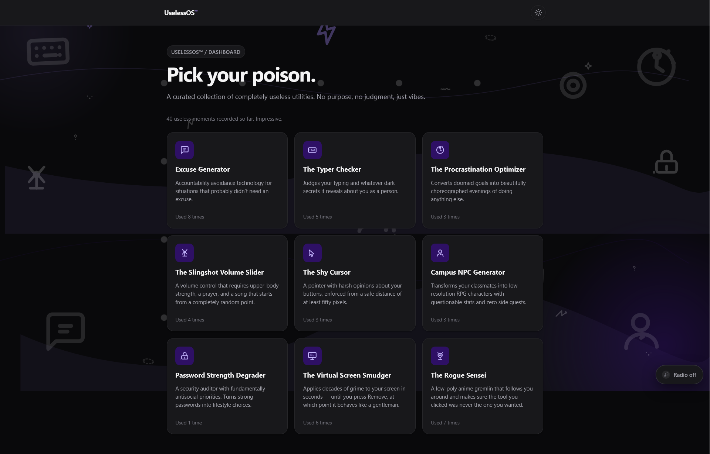
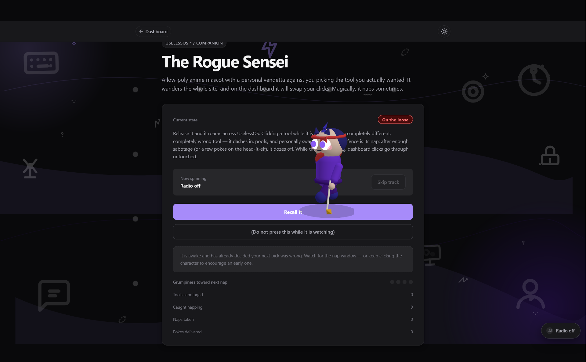
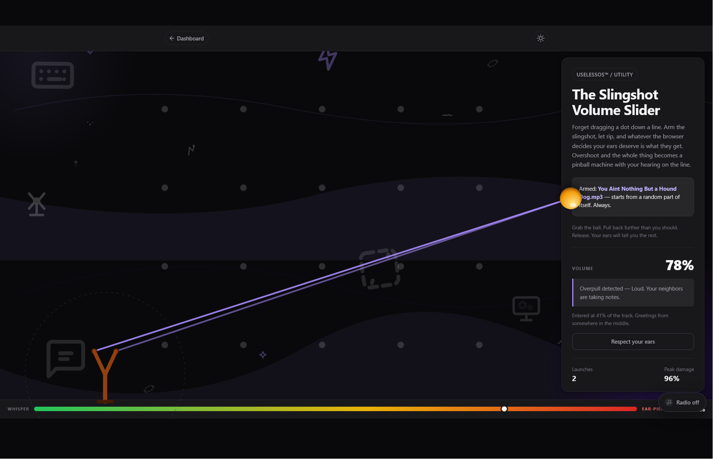

# UselessOS 🎯

## Basic Details
### Team Name: JoJo

### Team Members
- Team Lead: Alan Joy - CET 
- Member 2: Woitiwe Simson - CET

### Project Description
Useless OS is a collection of 9 totally helpful little utilities that make life worth living. We have various little tidbits ranging from a helpful 3d japanese sensei, to a password refiner among many others. 

### The Problem (that doesn't exist)
Every website that exists on the internet nowadays is made with serious intentions by serious business people. We believe fun can be incorporated into every aspect of life. Therefore, this website is a testament to the above statement. 

### The Solution (that nobody asked for)
Our fun website lets users unwind as they experience the joys of what it feels like to use a website that was made for fun. Dare we say, it was made by the people for the people

## Technical Details
### Technologies/Components Used
#### Framework & core
- React 19 + React DOM — UI
- TypeScript 6.0 — typed JS (build via tsc -b)
- Vite 8 — dev server + bundler
- @vitejs/plugin-react — React fast-refresh
#### 3D / visuals
- three.js 0.178 (+ @types/three) — the Rogue Sensei's 3D character
- CSS + inline SVG — background art, icons, doodles, waves
#### Tooling
- ESLint 10 (eslint.config.js flat config) with typescript-eslint, eslint-plugin-react-hooks, eslint-plugin-react-refresh
- @types/react, @types/react-dom, @types/node
- No CSS framework, no router library (custom toolRouter), no state library (custom stores + useSyncExternalStore)
#### Runtime APIs used
- Web Audio API — synthesized lo-fi radio/pads
- HTMLAudioElement — playlist file playback
- WebGL (via three) — sensei overlay
- localStorage — theme/music prefs + persisted stats

### Implementation
For Software:

### Installation

Make sure you have Node.js installed — v20.19+ or v22.12+ (required by Vite 8).

Clone the repo, open a terminal in the project folder, then:

    npm install

This pulls in three.js and @types/three, which power the Rogue Sensei's 3D overlay.

### Run

Start the development server:

    npm run dev

Then open http://localhost:5173 in your browser (Vite prints the exact URL — if the port is busy it will pick another one).

Other useful commands:

    npm run build    # type-checks (tsc -b) then builds into dist/
    npm run preview  # serve the production build locally
    npm run lint     # ESLint over the codebase

No backend or API keys are needed — everything runs client-side in the browser with self-hosted audio and artwork.

### Project Documentation
For Software:

# Screenshots

*Main Dashboard*

*three.js Sensei*

*Slingshot Volume Controller*

## Team Contributions
- Alan Joy: ThreeJS Sensei, Background music, Slingshot volume slider, shy cursor etc. 
- Woitiwe Simson: The type checker, password degrader, excuse generator, NPC generator etc.

---
Made with ❤️ at TinkerHub Useless Projects 

